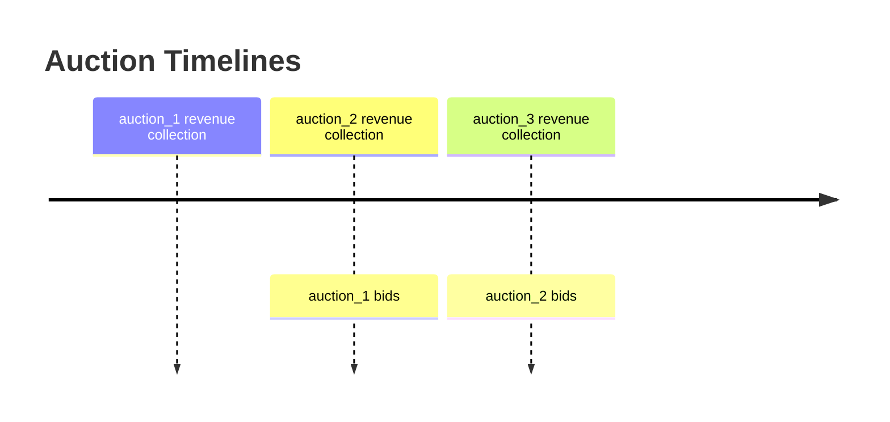

# Auction

## Summary

We propose a new Cosmos SDK module, that will provide mechanism for protocol owned auctions.

UX Chain will now auction a portion of collected fees and introduce a token burning mechanism, unlocking a way to a potentially deflationary UX token.

## Rewards Auction

Rewards Auction will auction portion of protocol collected fees against the UX token. The winner of the auction will receive the rewards, while the bid UX tokens will be burned. This mechanism offers several potential benefits, including:

- Counter the inflation mechanism. When burn rate is higher than the staking inflation, then the token supply can go into deflation mode.
- The regular burning of UX tokens demonstrates a commitment to the long-term success of the project.
- Access to a privileged functionality: when burning UX tokens, users will access the protocol revenues.

### Mechanism

Burn mechanism will be implemented as a part of a new native module. The auction is composed from two phases:

- bid collection: during this phase, everyone pledges UX tokens to auction revenues basket. At the end of this phase, the EndBlocker executes the auction and rewards the highest bidder.
- revenue collection: time when we collect revenues for each auction. The revenue collection phase for auction `a_(n+1)` starts at the end of auction `a_n`. This way, bidders know exactly the amount of revenues collected for `a_(n+1)` .

Any UX token holder can place a bid to buy the basket. At the end of the bid collection phase we settle the auction.

If, during a bid collection phase, we didn’t get any bid, then the revenues are rolled over to the next auction.

### Parameters

1. `duration` : time duration when we collect bids for the current auction. Initial value: 7 days.
2. `min_bid` is the minimum increase of the previous bid or the minimum bid if it's the
3. `auction_account`: an account receiving protocol revenues and managing the burn auction. This will be a sub-module account, and used to share with x/leverage and x/metoken modules.

We also extend leverage and metoken params:

1. `leverage params.rewards_auction_fee`: the interest increase that will be accrued on borrows that is sent to the auction module for the rewards auction. So, 2% means, that there is additional 2% per year fee collected.
2. `metoken params.rewards_auction_fee_factor`: determines the portion of total fees collected by the metoken module that will go for the rewards auction. 2% means that 2% of collected fees will go to the rewards auction.

### Storage

- `last_bid`
- `reward_auction_id` : current auction ID.
- `rewards_auction_end`: current auction end time.

### Settlement

The settlement of a given auction occurs when `blockTime ≥ rewards_auction_end`. If a non-zero UX bid was placed during this period (i.e. there exists a bid), the following procedure will take place:

- The winning UX bid amount is burned.
- The basket of coins held by the auction module is transferred to the winning bidder.
- `EventRewardsAuctionResult` is emitted.
- The `last_bid` is cleared.

Finally, we do:

- The `reward_auction_id` is incremented by 1 and the `current_rewards_auction_end` is set to `now + auction_duration`.
- TODO: The accumulated exchange fees are transferred to the `auction` module for the new upcoming auction.

### Collecting revenues

#### x/leverage

Two new x/leverage params will have to be defined (as part of the x/leverage params):

- `leverage_revenue_rate`: We should take a fraction of the lending fees, and send it to the `auction_account` every day using x/leverage EndBlocker.
  - TODO: need to think about the EndBlocker implementation or find something more efficient.
  - For example, if the ATOM pool is earning 5% yield every week, we should take 1/5th of that yield ie. 1% and set it aside to be auctioned every week against UMEE (UX token) and UMEE UX will be burnt
- `LeveragePools` affected:
  - This should only be applied to the largest pools: Atom, Celestia, USDC
  - The logic behind this is that these are the only pools that have enough liquidity to warrant taking a fraction of the lending yield
  - Smaller pools do not have enough activity to warrant taking away yield from the lenders
    - additionally smaller pools do not have enough borrowers

#### x/metoken

All fees generated by meTokens will be allocated to the `auction_account`.

- This is to replace the reward replacement model proposed above
