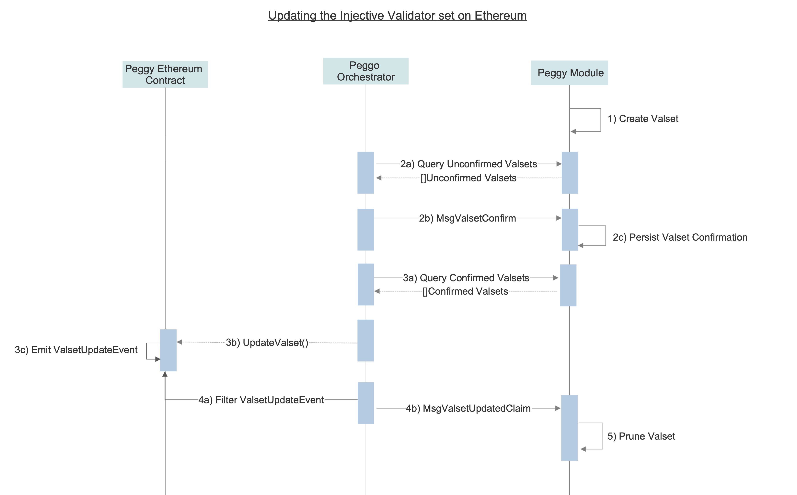
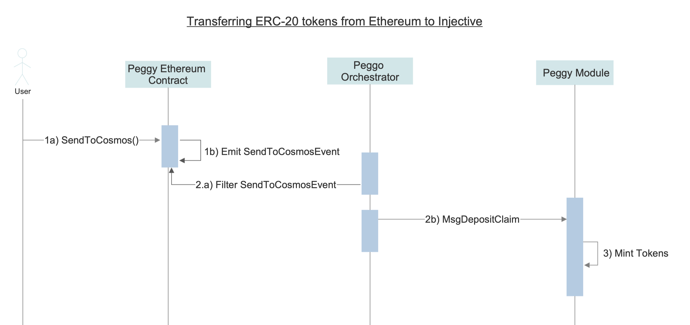
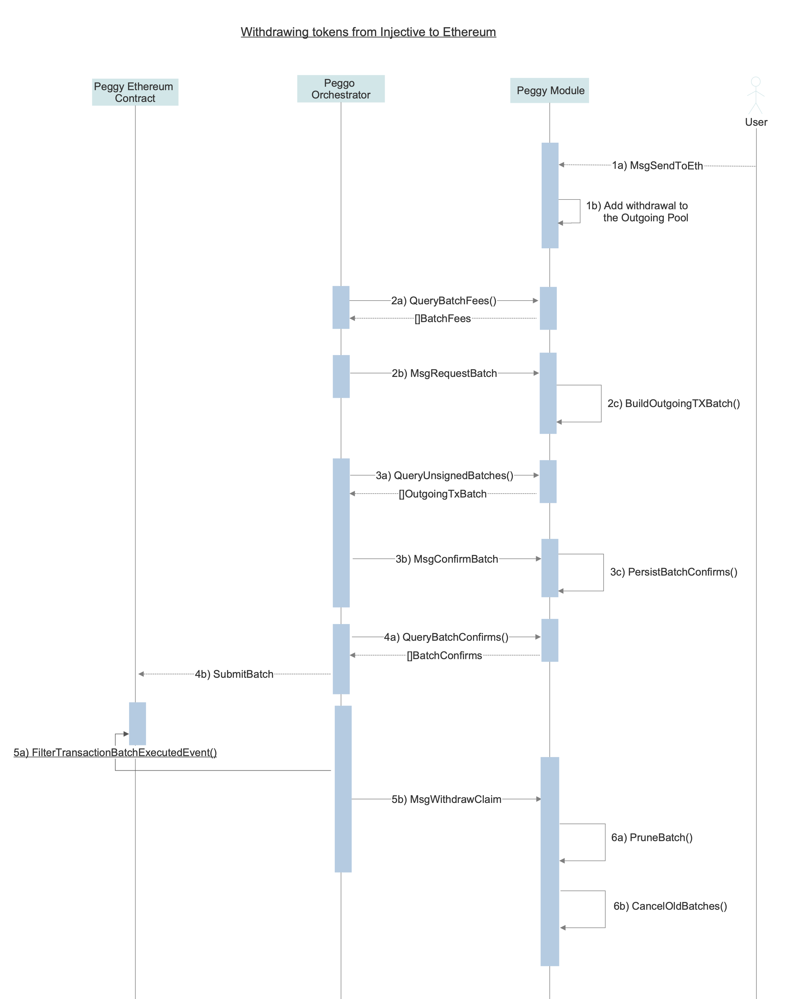

<!--
order: 2
title: Workflow
-->

# Workflow

## Conceptual Overview

To recap, each operator is responsible for maintaining 3 secure processes:

1. An Injective Chain Validator node (`injectived`) to sign blocks 
1. A fully synced Ethereum full node
1. The peggo orchestrator which runs: 
   * An `Eth Signer`, which signs `Claims` with the `Operator`'s Ethereum keys and submits using [messages](./04_messages.md#Ethereum-Signer-messages). 
   * An Ethereum `Oracle`, which observes events from Ethereum full nodes and relays them using [messages](./04_messages.md#Oracle-messages). 
   * A `Relayer` which submits Valset updates and batch transactions to the Peggy contract on Ethereum

## Delegate Addresses

This document outlines the Ethereum signatures, all contract calls on [Peggy.sol](https://github.com/InjectiveLabs/peggo/blob/master/solidity/contracts/Peggy.sol) accept an array of signatures provided by a validator set stored in the contract.

Validators make these signatures with their `Delegate Ethereum address` this is an Ethereum address set by the validator using the [SetOrchestratorAddress](./04_messages.md#SetOrchestratorAddress) message. The validator signs over this Ethereum address, as well as an Injective Chain address for oracle operations and submits it to the chain to register these addresses for use in the Ethereum signer and oracle subsystems.

The `Delegate Ethereum address` then represents that validator on the Ethereum blockchain and will be added as a signing member of the multisig with a weighted voting power as close as possible to the Injective Chain voting power.

## Signing flow

The signing flow works as follows.

1. The Peggy module produces a `ValidatorSetRequest`or `BatchRequest`. These requests are placed into the store and act as coordination points for signatures
1. `Ethereum Signer` processes query these requests and perform a signature with the `Delegate Ethereum Address`
1. The `Ethereum Signer` submits the signature as a [transaction](./04_messages.md#Ethereum-Signer-Messages)
1. The Peggy module verifies that the signature is made with the correct key and over the correct data before storing it
1. `Relayers` now query these signatures and assemble them into an Ethereum contract call to submit to [Peggy.sol](https://github.com/InjectiveLabs/peggo/blob/master/solidity/contracts/Peggy.sol)
1. The message is submitted and executed on the Ethereum chain

## Ethereum to Injective Oracle

All `Operators` run an `Oracle` binary. This separate process monitors an Ethereum node for new events involving the `Peggy Contract` on the Ethereum chain. Every event that `Oracle` monitors has an event nonce. This nonce is a unique coordinating value for a `Claim`. Since every event that may need to be observed by the `Oracle` has a unique event nonce `Claims` can always refer to a unique event by specifying the event nonce.

- An `Oracle` observes an event on the Ethereum chain, it packages this event into a `Claim` and submits this claim to the Injective Chain as an [Oracle message](./04_messages.md#Oracle-messages)
- Within the Peggy module this `Claim` either creates or is added to an existing `Attestation` that matches the details of the `Claim` once more than 66% of the active `Validator` set has made a `Claim` that matches the given `Attestation` the `Attestation` is executed. This may mint tokens, burn tokens, or whatever is appropriate for this particular event.
- In the event that the 2/3 of the validators can not agree on a single `Attestation`, the oracle is halted. This means no new events will be relayed from Ethereum until some of the validators change their votes. There is no slashing condition for this, with reasoning outlined in the [slashing spec](./05_slashing.md)

## Relaying rewards

Relaying rewards cover all messages that need to be submitted to Ethereum from Injective. This includes Validator set updates and transaction batches. Keep in mind that these messages cost a variable amount of money based on wildly changing Ethereum gas prices and it's not unreasonable for a single batch to cost over a million gas.

A major design decision for our relayer rewards was to always issue them on the Ethereum chain. This has downsides, namely some strange behavior in the case of validator set update rewards.

But the upsides are undeniable, because the Ethereum messages pay `msg.sender` any existing bot in the Ethereum ecosystem will pick them up and try to submit them. This makes the relaying market much more competitive and less prone to cabal like behavior.

### Types of Assets

#### Native Ethereum assets

Any asset originating from Ethereum which implements the ERC-20 standard can be transferred from Ethereum to Injective by calling the `sendToCosmos` function on the [Peggy.sol](https://github.com/InjectiveLabs/peggo/blob/master/solidity/contracts/Peggy.sol) contract which transfers tokens from the sender's balance to the Peggy contract. 

The validators all run their oracle processes which submit MsgDepositClaim messages describing the deposit they have observed. Once more than 66% of all voting power has submitted a claim for this specific deposit representative tokens are minted and issued to the Injective Chain address that the sender requested.

The validators off-chain relayer process observe this event and submit `MsgDepositClaim` messages describing the deposit. Once more than 66% of all voting power has submitted a claim for this specific deposit, representative tokens are minted and issued to the Injective Chain address that the depositor specified. These representative tokens have a denomination prefix of `peggy` concatenated with the ERC-20 token hex address, e.g. `peggy0xdac17f958d2ee523a2206206994597c13d831ec7`. 

#### Native Cosmos SDK assets

An asset native to a Cosmos SDK chain (e.g. ATOM) first must be represented on Ethereum before it's possible to bridge it. To do so,  the [Peggy contract](https://github.com/InjectiveLabs/peggo/blob/master/solidity/contracts/Peggy.sol) allows anyone to create a new ERC-20 token representing a Cosmos asset by calling the `deployERC20` function. 

This endpoint is not permissioned, so it is up to the validators and the users of the Peggy module to declare any given ERC-20 token as the representation of a given asset.

When a user on Ethereum calls `deployERC20` they pass arguments describing the desired asset. [Peggy.sol](https://github.com/InjectiveLabs/peggo/blob/master/solidity/contracts/Peggy.sol) uses an ERC-20 factory to deploy the actual ERC-20 contract and assigns ownership of the entire balance of the new token to the Peggy contract itself before emitting an `ERC20DeployedEvent`. 

The peggo orchestrators observe this event and decide if a Cosmos asset has been accurately represented (correct decimals, correct name, no pre-existing representation). If this is the case, the ERC-20 contract address is adopted and stored as the definitive representation of that Cosmos asset on Ethereum.

##  End-to-end Lifecycle

This document describes the end to end lifecycle of the Peggy bridge. 

### Peggy Smart Contract Deployment

In order to deploy the Peggy contract, the validator set of the native chain (Injective Chain) must be known. Upon deploying the Peggy contract suite (Peggy Implementation, Proxy contract, and ProxyAdmin contracts), the Peggy contract (the Proxy contract) must be initialized with the validator set. 

The proxy contract is used to upgrade Peggy Implementation contract  which is needed for bug fixing and potential improvements during initial phase. It is a simple wrapper or "proxy" which users interact with directly and is in charge of forwarding transactions to the Peggy implementation contract, which contains the logic. The key concept to understand is that the implementation contract can be replaced but the proxy (the access point) is never changed.

The ProxyAdmin is a central admin for the Peggy proxy, which simplifies management. It controls upgradability and ownership transfers. The ProxyAdmin contract itself has a built-in expiration time which, once expired, prevents the Peggy implementation contract from being upgraded in the future. 

Then the following peggy genesis params should be updated:
1. `bridge_ethereum_address` with Peggy proxy contract address 
2. `bridge_contract_start_height` with the height at which the Peggy proxy contract was deployed

This completes the bootstrap of the Peggy bridge and the chain can be started.

### **Updating Injective Chain validator set on Ethereum**

A validator set is a series of Ethereum addresses with attached normalized powers used to represent the Injective validator set (Valset) in the Peggy contract on Ethereum. The Peggy contract stays in sync with the Injective Chain validator set through the following mechanism: 
1. **Creating a new Valset on Injective:** A new Valset is automatically created on the Injective Chain when either:
- the cumulative difference of the current validator set powers compared to the last recorded Valset exceeds 5%
- a validator begins unbonding
2. **Confirming a Valset on Injective:** Each operator is responsible for confirming Valsets that are created on Injective. This confirmation is constructed by having the validator's delegated Ethereum key sign over a compressed representation of the Valset data, which the orchestrator submits to Injective through a `MsgValsetConfirm`. The peggy module verifies the validity of the signature and persists the operator's Valset confirmation to the peggy state.
3. **Updating the Valset on the Peggy contract:** After a 2/3+ 1 majority of validators have submitted their Valset confirmations for a given Valset, the orchestrator submits the new Valset data to the Peggy contract by calling `updateValset`. 
The Peggy contract then validates the data, updates the valset checkpoint, transfers valset rewards to sender and emits a `ValsetUpdateEvent`.
4. **Acknowledging the `ValsetUpdateEvent` on Injective:** Orchestrators witnesses the `ValsetUpdateEvent` on Ethereum, and sends a `MsgValsetUpdatedClaim` which informs the Peggy module that a given Valset has been updated on Ethereum. 
5. **Pruning Valsets on Injective:** Once a  2/3 majority of validators send their `MsgValsetUpdatedClaim` message for a given `ValsetUpdateEvent`, all the previous valsets are pruned from the peggy module state.
6. **Valset Slashing:** Validators are responsible for signing and confirming the valsets as described in Step 2 and are subject to slashing for not doing so. Read more [valset slashing](./05_slashing.md) 

----

### **Transferring ERC-20 tokens from Ethereum to Injective**

ERC-20 tokens are transferred from Ethereum to Injective through the following mechanism:
  1. **Depositing ERC-20 tokens on the Peggy Contract:** A user initiates a transfer of ERC-20 tokens from Ethereum to Injective by calling the `SendToCosmos` function on the Peggy contract which deposits tokens on the Peggy contract and emits a `SendToCosmosEvent`.

     The deposited tokens will remain locked until withdrawn at some undetermined point in the future. This event contains the amount and type of tokens, as well as a destination address on the Injective Chain to receive the funds.

  2. **Confirming the deposit:** Each peggo orchestrator witnesses the `SendToCosmosEvent` and sends a `MsgDepositClaim` which contains the deposit information to the Peggy module. 

  3. **Minting tokens on the Injective:** Once a 2/3 majority of validators confirm the deposit claim, the deposit is processed. 
  - If the asset is Ethereum originated, the tokens are minted and transferred to the intended recipient's address on the Injective Chain.
  - If the asset is Cosmos-SDK originated, the coins are unlocked and transferred to the intended recipient's address on the Injective Chain.

-----
### **Withdrawing tokens from Injective to Ethereum**

1. **Request Withdrawal from Injective:** A user can initiate the transfer of assets from the Injective Chain to Ethereum by sending a `MsgSendToEth` transaction to the peggy module.
- If the asset is Ethereum native, the represented tokens are burnt. 
- If the asset is Cosmos SDK native, coins are locked in the peggy module. 
The withdrawal is then added to pending withdrawal OutgoingTx Pool. 
2. **Batch Creation:** The peggo orchestrator observes the pending withdrawal pool of OutgoingTx's . The orchestrator (or any external third party) then requests a batch of to be created for a given token by sending `MsgRequestBatch` to the Injective Chain. The Peggy module picks unbatched txs from the withdrawal pool and creates the token-specific Outgoing Batch.
3. **Batch Confirmation:**  Upon detecting the existence of an Outgoing Batch, the peggo orchestrator signs over the batch with its Ethereum key and submits a `MsgConfirmBatch` tx to the Peggy module.
4. **Submit Batch to Peggy Contract:**  Once a 2/3 majority of validators confirm the batch, the peggo orchestrator sends `SubmitBatch` tx to the Peggy contract on Ethereum. The Peggy contract validates the signatures, updates the batch checkpoint, processes the batch ERC-20 withdrawals, transfers the batch fee to the tx sender and emits a `TransactionBatchExecutedEvent`.
5. **Send Withdrawal Claim to Injective:** Validators running the peggo orchestrator witness the `TransactionBatchExecutedEvent` and send a `MsgWithdrawClaim` containing the withdrawal information to the Peggy module.
6. **Prune Batches** Once a 2/3 majority of validators submit their `MsgWithdrawClaim` , the batch is deleted along and all previous batches are cancelled on the Peggy module.
7. **Batch Slashing:** Validators are responsible for confirming batches and are subject to slashing if they fail to do so. Read more on [batch slashing](./05_slashing.md). 

Note while that batching reduces individual withdrawal costs dramatically, this comes at the cost of latency and implementation complexity. If a user wishes to withdraw quickly they will have to pay a much higher fee. However this fee will be about the same as the fee every withdrawal from the bridge would require in a non-batching system.

